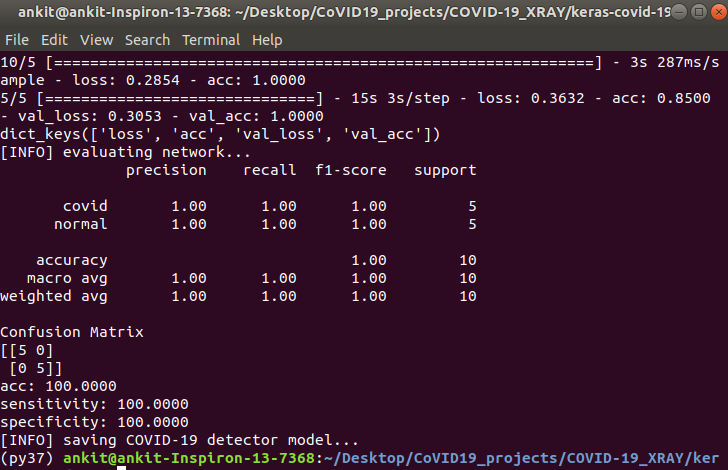

# Detect_COVID-19_from_X-ray (Model deployed using AWS)
Frontend folder contains the code that was written to allow the user to upload test images and get the predictions. The aim of this experiment was to see if different CNN architectures would make a difference in the prediction accuracy. VGGNet and DenseNet both architectures are employed. Former using Tensoflow + Keras and latter using Pytorch Lightning. The model is deployed using Amazon AWS. 

## Disclaimer
This git repo is for educational purposes only. It is not meant to be a reliable, highly accurate COVID-19 diagnosis system, nor has it been professionally or academically vetted.

My goal is simply to inspire people and demonstrate how studying computer vision/deep learning and then applying that knowledge to the medical field can make a big impact on the world. You don’t need a degree in medicine to make an impact in the medical field. Machine Learning practitioners working closely with doctors and medical professionals solves complex problems, save lives, and make the world a better place.

Journal curators, and peer review systems are being overwhelmed with submissions containing COVID-19 prediction models of questionable quality. Please do not take the model from this post and submit it to a journal.

## Datasets

The COVID-19 X-ray image dataset used for this project was curated by Dr. Joseph Cohen, a postdoctoral fellow at the University of Montreal who started collecting X-ray images of COVID-19 cases and publishing them in a GitHub repo. Kaggle’s Chest X-Ray Images (Pneumonia) dataset has been used to pick randomly 25 X-ray images of healthy patients.

The baseline models uses only covid-chestxray-dataset which is rather small (79 images at the time of writing).

They are also accessible with following python packages:

https://github.com/ieee8023/covid-chestxray-dataset

https://github.com/mlmed/torchxrayvision

## Interface:

## Training Stats:

## Inferences

High quality, peer reviewed image datasets for COVID-19 don’t exist yet, so we had to work with what we had. Even with VGGNet full accuracy was achieved on test set. 

We sampled 25 images from Cohen’s dataset, taking only the posterioranterior (PA) view of COVID-19 positive cases.
We then sampled 25 images of healthy patients using Kaggle’s Chest X-Ray Images (Pneumonia) dataset. From there we used Keras and TensorFlow to train a COVID-19 detector that was capable of obtaining 100% accuracy on our testing set with 100% sensitivity and 100% specificity (given our limited dataset).

Please keep in mind that the COVID-19 detector is for educational purposes only (refer to my “Disclaimer” at the top).

## References

Detecting COVID-19 in X-ray images with Keras, TensorFlow, and Deep Learning by Adrian Rosebrock on March 16, 2020

## Acknowledgement

Thanks to pytorch lightning team, Adrain Rosebrock, and Dr. Joseph Cohen.

## Contributions are Welcomed

Anyone is welcome to contribute and use this project!

